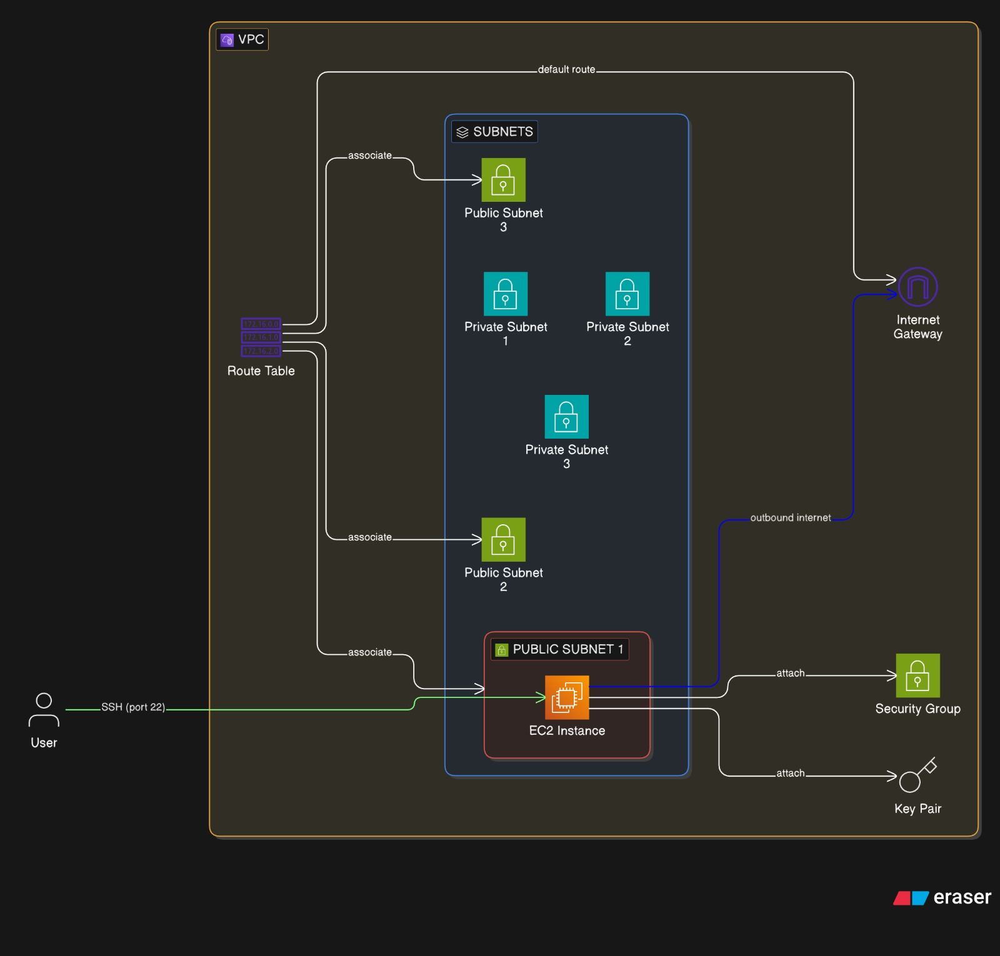

# Terraform AWS Custom VPC and EC2 Instance

This Terraform project creates a custom VPC in AWS with public and private subnets, a security group allowing SSH access, and an EC2 instance running Amazon Linux 2.

## Architecture



The infrastructure includes:
- A VPC with CIDR `10.0.0.0/16`
- 3 Public subnets across different availability zones
- 3 Private subnets (though not fully utilized in this setup)
- An Internet Gateway for public access
- A security group allowing SSH from your public IP
- An EC2 t2.micro instance with a key pair

## Prerequisites

- [Terraform](https://www.terraform.io/downloads.html) installed (version 1.0+)
- AWS CLI configured with appropriate credentials
- SSH key pair (public key provided in variables)

## Setup

1. Clone this repository:
   ```bash
   git clone https://github.com/raj1552/Custom-VPC-and-Launched-EC2-instance-using-Terraform.git
   cd Custom-VPC-and-Launched-EC2-instance-using-Terraform
   ```

2. Initialize Terraform:
   ```bash
   terraform init
   ```

3. Update variables in `vars.tf` or create a `terraform.tfvars` file:
   - Set `MYIP` to your public IP address in CIDR format (e.g., `203.0.113.1/32`)
   - The `PUB_KEY` is already set to your SSH public key

4. Plan the deployment:
   ```bash
   terraform plan
   ```

5. Apply the configuration:
   ```bash
   terraform apply
   ```

## Variables

| Variable | Description | Default |
|----------|-------------|---------|
| REGION | AWS region | us-east-1 |
| ZONE1 | Availability zone 1 | us-east-1a |
| ZONE2 | Availability zone 2 | us-east-1b |
| ZONE3 | Availability zone 3 | us-east-1c |
| USER | Default SSH user | ec2-user |
| PUB_KEY | SSH public key | Your Ed25519 key |
| MYIP | Your public IP for SSH access | Required |

## Outputs

- `PublicIP`: The public IP address of the EC2 instance

## Usage

After deployment, you can SSH into the instance:
```bash
ssh -i <your-private-key> ec2-user@<PublicIP>
```

## Cleanup

To destroy the resources:
```bash
terraform destroy
```

## Security Notes

- The security group only allows SSH from your specified IP address
- Never commit `.tfstate` files or AWS credentials to version control
- Use environment variables or AWS profiles for authentication instead of hardcoding keys
